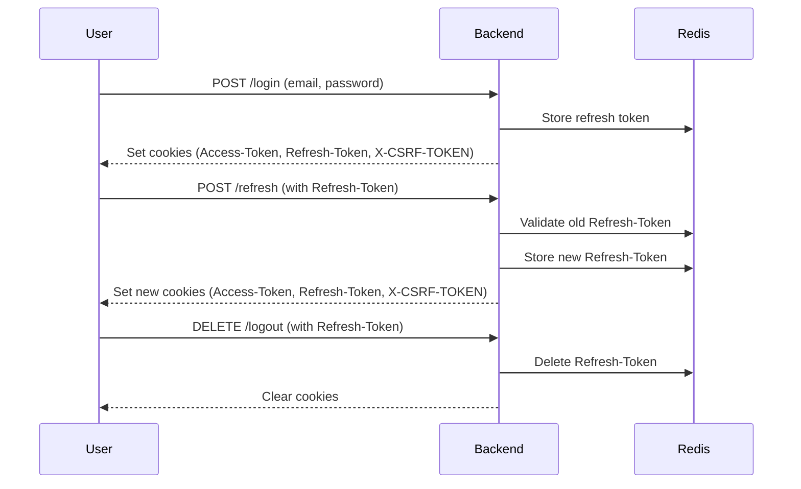

<h1 align="center"> FastAPI Boilerplate </h1>
<p align="center" markdown=1>
  <i>Template to speed your FastAPI development up.</i>
</p>

<p align="center">
  <a href="https://python.org/">
      
  </a>
  <a href="https://fastapi.tiangolo.com">
      
  </a>
  <a href="https://docs.pydantic.dev/">
      
  </a>
  <a href="https://www.postgresql.org">
      
  </a>
  <a href="https://redis.io">
      
  </a>
  <a href="https://docs.docker.com/compose/">
      
  </a>
</p>


## Introduction

This project, **FastAPI Boilerplate**, is designed to provide a robust and scalable starting point for building modern web applications. It integrates essential tools and best practices to help developers quickly set up a project with minimal effort.


## About

The boilerplate includes:

- [`FastAPI`](https://fastapi.tiangolo.com): modern Python web framework for building APIs.
- [`Pydantic V2`](https://docs.pydantic.dev/2.4/): the most widely used data Python validation library, rewritten in Rust.
- [`SQLAlchemy V2`](https://docs.sqlalchemy.org/en/20/changelog/whatsnew_20.html): Python SQL toolkit and Object Relational Mapper.
- [`PostgreSQL`](https://www.postgresql.org): The World's Most Advanced Open Source Relational Database.
- [`Redis`](https://redis.io): Open source, in-memory data store used by millions as a cache, message broker and more.
- [`Docker Compose`](https://docs.docker.com/compose/) With a single command, create and start all the services from your configuration.

This setup is perfect for developers looking to start their project with a solid foundation that is maintainable and easy to extend.


## Features

- ⚡️ Fully async
- 🚀 Pydantic V2 and SQLAlchemy V2
- 🔐 User authentication with JWT
- 🍪 Cookie based access and refresh token
- 🏬 Easy redis caching
- ⚙️ Efficient and robust queries with **SQLAlchemy**
- ⎘ Offset and cursor pagination support
- 🦾 Easily extendable
- 🤸‍♂️ Flexible
- 🚚 Easy running with docker compose


## Table of Contents

1. [Introduction](#introduction)
2. [About](#about)
3. [Features](#features)
4. [Authentication](#authentication)
    - [Overview](#overview)
    - [Components](#components)
    - [Token Flow Diagram](#token-flow-diagram)
    - [Identity Verification](#identity-verification)
    - [Security Measures](#security-measures)
    - [Configuration](#configuration)
<!-- 5. [Project Structure](#project-structure)   
7. [Contributing](#contributing)
8. [License](#license) -->


## Authentication

### Overview

This document provides a detailed explanation of the authentication system implemented in the project. The system utilizes JWT-based authentication with added security through CSRF tokens, session middleware, and cookies to handle access and refresh tokens. It includes mechanisms for login, token refresh, and logout functionalities.

### Components

#### **1. JWTHandler**

The `JWTHandler` class is responsible for encoding and decoding JSON Web Tokens (JWTs). It supports both access and refresh tokens.

##### **Methods**
- **`encode(payload: dict) -> str`**: Encodes a payload into an access token with an expiration time.
- **`encode_refresh_token(payload: dict) -> str`**: Encodes a payload into a refresh token with a longer expiration time.
- **`decode(token: str) -> dict`**: Decodes a JWT, verifying its validity and expiration.
- **`decode_expired(token: str) -> dict`**: Decodes a JWT without verifying expiration (used for expired tokens).
- **`token_expiration(token: str) -> datetime | None`**: Retrieves the expiration time of a JWT.

##### **Errors**
- **`JWTDecodeError`**: Raised if the token is invalid.
- **`JWTExpiredError`**: Raised if the token is expired.


#### **2. AuthenticationHandler**

The `AuthenticationHandler` class handles user authentication by validating tokens and extracting user identifiers.

##### **Methods**
- **`_get_token(token_type: str) -> str`**: Retrieves a token from cookies based on its type (Access/Refresh).
- **`_decode_token(token: str, key: str) -> str`**: Decodes the token and validates the presence of a specific key.
- **`_validate_token(token: str, credentials, token_type: str) -> None`**: Validates the provided credentials against the token.
- **`authenticate_user(token_type: str, key: str, credentials=None) -> str`**: Combines the above methods to authenticate a user and return their identifier.


#### **3. SessionMiddleware**

The `SessionMiddleware` generates a unique session ID for each user request and stores it in a cookie. It ensures session continuity.


#### **4. AuthController**

The `AuthController` manages the business logic for authentication-related operations, such as login, token refresh, and logout.

##### **Methods**
- **`login(login_user_request, cache) -> Token`**: Authenticates a user, generates tokens, and stores the refresh token in a Redis cache.
- **`refresh_token(old_refresh_token, session_id, cache) -> Token`**: Generates new access and refresh tokens after validating the old refresh token.
- **`logout(refresh_token, cache) -> None`**: Deletes the refresh token from the Redis cache.


#### **5. Endpoints**

The authentication system exposes several API endpoints for client interaction.

##### **Routes**
- **`POST /login`**: Logs in the user, generates tokens, and sets cookies.
- **`POST /refresh`**: Issues new tokens using the refresh token.
- **`GET /me`**: Retrieves the current user's information.
- **`DELETE /logout`**: Logs out the user by clearing tokens and cookies.


### Token Flow Diagram




### Identity Verification

To verify a user's identity, the `authenticate_user` method in the `AuthenticationHandler` class is used:

-    Extract the Access/Refresh token from cookies.
-    Decode the token and validate its contents.
-    Return the user's unique identifier (UUID).

This process ensures secure and reliable authentication while maintaining user data integrity.


### Security Measures

1. **HTTPOnly Cookies**: Access and refresh tokens are stored in cookies with `HttpOnly` and `Secure` flags.

2. **CSRF Protection**: CSRF tokens are included in the response headers to protect against cross-site request forgery attacks.

3. **Redis Integration**: Refresh tokens are stored in Redis with expiration times, ensuring they can be invalidated on logout or misuse.

4. **Session IDs**: Unique session IDs are generated and stored in cookies to enhance user session security.

5. **Token Expiration**: Both access and refresh tokens have configurable expiration times.


### Configuration

Update the following settings in the configuration file to customize token expiration, algorithm, and other parameters:

```env
SECRET_KEY = "your_secret_key"
JWT_ALGORITHM = "HS256"
ACCESS_TOKEN_EXPIRE_MINUTES = 15
REFRESH_TOKEN_EXPIRE_MINUTES = 60
SESSION_EXPIRE_MINUTES = 15
```
