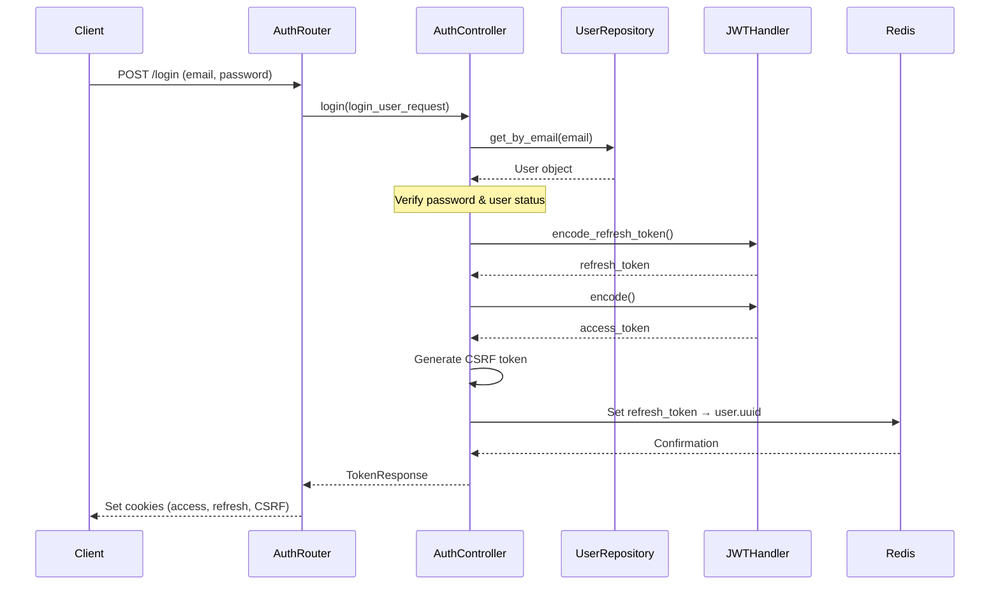
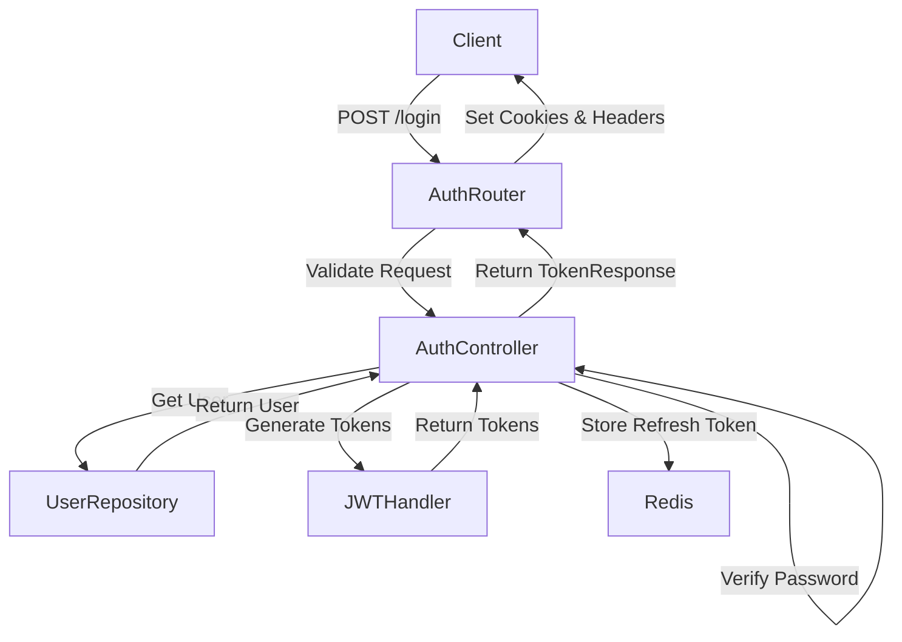
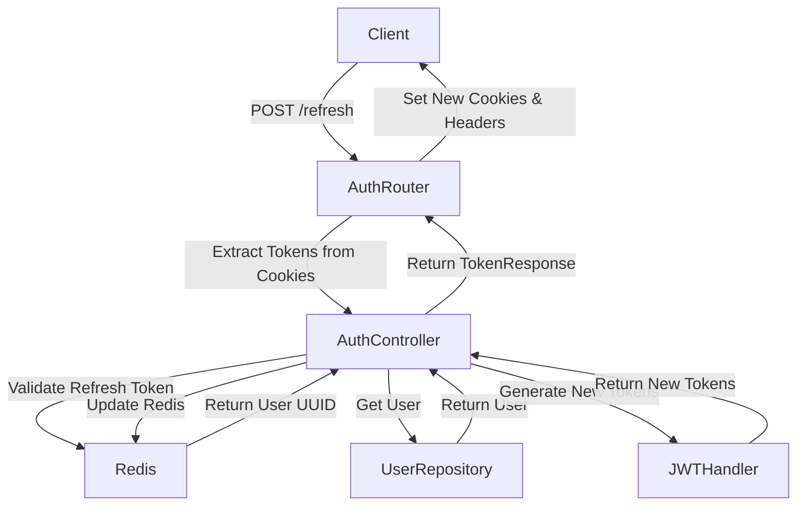

# Authentication

## Overview

This document provides a detailed explanation of the authentication system implemented in our FastAPI application. The system uses JWT (JSON Web Tokens) for secure authentication, Redis for token storage and management, and includes features like session tracking, refresh tokens, and CSRF protection.

## Components

The authentication system consists of several interconnected components:

1. **JWT Handler**: Manages token creation, validation, and expiration
2. **Cache System**: Uses Redis for token storage and validation
3. **Session Management**: Maintains user sessions via cookies
4. **Authentication Controller**: Orchestrates login, token refresh, and logout operations
5. **API Routes**: Exposes authentication endpoints to clients

## Authentication Flow

## Detailed Component Descriptions

### 1. JWT Handler (`jwt.py`)

The JWT Handler is responsible for encoding and decoding JSON Web Tokens using a secret key and specified algorithm.

#### Key Features:

- 🔑 **Token Generation**: Creates both access and refresh tokens with different expiration times
- 🔍 **Token Validation**: Verifies token integrity and expiration
- ⏰ **Expiration Management**: Extracts and manages token expiration times
- 🛡️ **Error Handling**: Custom exceptions for invalid or expired tokens

#### Token Types:

- **Access Token**: Short-lived token used for API access (contains user UUID and role)
- **Refresh Token**: Long-lived token used to obtain new access tokens (contains verification info)

### 2. Cache System (`cache.py`)

Redis is used as a cache backend to store refresh tokens and their association with user UUIDs.

#### Key Features:

- 🔄 **Token Storage**: Stores refresh tokens with expiration times
- 🔌 **Connection Management**: Verifies Redis availability
- ❌ **Token Invalidation**: Allows for token revocation during logout

??? tip
    Using Redis for token storage allows for immediate token invalidation in case of security concerns.

### 3. Session Management (`session.py`)

The `SessionMiddleware` ensures every request has a unique session identifier stored in cookies.

#### Key Features:

- 🆔 **Session Generation**: Creates a random session ID for new visitors
- 🍪 **Cookie Management**: Sets secure, HTTPOnly cookies for session tracking
- 🔒 **Security Settings**: Implements SameSite and other security measures

### 4. Authentication Controller (`auth.py`)

The `AuthController` contains the business logic for user authentication processes.

#### Key Methods:

##### `login()`

This method handles user authentication and token generation:

1. Retrieves user by email from the database
2. Verifies password using `PasswordHandler`
3. Checks if the user account is activated
4. Generates refresh and access tokens
5. Stores the refresh token in Redis with the user's UUID
6. Returns tokens to the caller

##### `refresh_token()`

Refreshes authentication tokens:

1. Validates the existing refresh token against Redis
2. Retrieves the associated user
3. Generates new access and refresh tokens
4. Updates Redis with the new refresh token
5. Invalidates the old refresh token
6. Returns the new tokens

##### `logout()`

Handles user logout:

1. Removes the refresh token from Redis
2. This invalidates the session, preventing further refresh operations

### 5. API Routes (`auth_api.py`)

The API endpoints expose the authentication functionality to clients.

#### Endpoints:

##### `POST /login`

Authenticates a user and issues tokens:

1. Receives login credentials (email and password)
2. Calls `AuthController.login()` to validate credentials and generate tokens
3. Sets secure HTTP-only cookies for:
   - Access token
   - Refresh token
4. Sets CSRF token in response headers

##### `POST /refresh`

Refreshes an expired access token:

1. Extracts refresh token and session ID from cookies
2. Calls `AuthController.refresh_token()` to validate and generate new tokens
3. Sets new tokens in cookies and headers

##### `GET /me`

Returns information about the authenticated user:

1. Uses the `get_current_user` dependency to extract and validate user from the access token
2. Returns user details (UUID, email, name, role, activation status)

##### `DELETE /logout`

Logs out the current user:

1. Calls `AuthController.logout()` to invalidate the refresh token in Redis
2. Clears all authentication cookies

## Login Process Step-by-Step

When a user attempts to log in, the following sequence of events occurs:

1. 📝 **Request Submission**:

   - Client sends a POST request to `/login` with email and password
   - `SessionMiddleware` ensures a session ID cookie exists (creates one if needed)

2. 🔍 **User Verification**:

   - `AuthController` retrieves the user by email from the database
   - If user exists, the provided password is verified against the stored hash
   - User activation status is checked

3. 🎟️ **Token Generation**:

   - Refresh token is created with user UUID and role information
   - Access token is created with user UUID and role
   - Random CSRF token is generated for additional security

4. 💾 **Token Storage**:

   - Refresh token is stored in Redis with the user's UUID as the value
   - Redis entry is set to expire after the configured refresh token lifetime

5. 🍪 **Response Preparation**:

   - Access token is set as an HTTP-only cookie with appropriate expiration
   - Refresh token is set as an HTTP-only cookie with appropriate expiration
   - CSRF token is included in response headers
   - All cookies use `secure`, `httponly`, and `samesite=strict` flags for security

## Security Features

The authentication system implements several security best practices:

### **Token Protection**

- HTTP-only cookies prevent JavaScript access to tokens
- Secure flag ensures tokens are only sent over HTTPS
- SameSite strict prevents CSRF attacks

### **Limited Token Lifetimes**

- Access tokens have short lifespans (configured in settings)
- Refresh tokens have longer but still limited lifespans

### **Token Refresh Mechanism**

- Allows maintaining authenticated sessions without frequent logins
- Old tokens are invalidated during refresh

### **Token Revocation**

- Refresh tokens can be invalidated immediately during logout
- Redis storage enables tracking and revoking specific tokens

### **CSRF Protection**

- CSRF tokens are required for state-changing operations
- Provides defense against cross-site request forgery attacks

## Flow Diagrams

### Login Flow

### Token Refresh Flow

## Best Practices

1. **Always use HTTPS** in production environments to prevent token interception.

2. **Keep token expiration times appropriate**:

    - Access tokens: 15-60 minutes
    - Refresh tokens: 1-7 days (depending on security requirements)

3. **Implement token rotation** on each refresh to prevent token reuse attacks.

4. **Log authentication events** for security monitoring and auditing.

5. **Implement rate limiting** to prevent brute force attacks.

## Troubleshooting

### Common Issues

1. **"Invalid credentials" error**:

   - Check if email exists in the database
   - Verify password hashing configuration

2. **"Token expired" error**:

   - Check system clock synchronization
   - Verify token expiration configuration
   - Use the refresh token endpoint instead of re-authentication

3. **Redis connection failures**:

   - Verify Redis server is running
   - Check network connectivity
   - Confirm Redis configuration settings

## Security Considerations

1. **Secret Key Protection**:

   - The JWT secret key must be kept secure
   - Use different keys for development and production

2. **Token Storage**:

   - Never store tokens in localStorage or sessionStorage
   - Always use HTTP-only cookies for token storage

3. **Token Expiration**:

   - Choose appropriate expiration times based on security requirements
   - Consider shorter expiration for higher security contexts

4. **User Account Security**:

   - Implement account lockout after failed login attempts
   - Provide notifications for suspicious login activities
