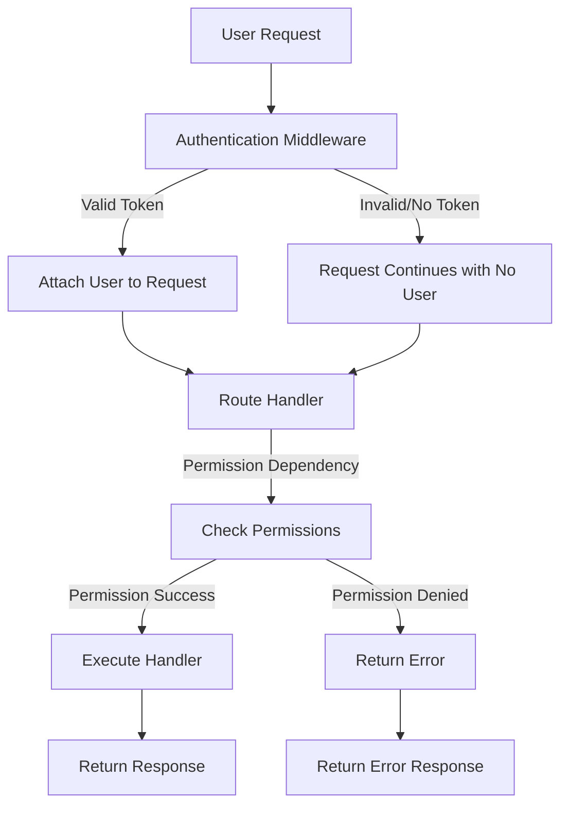
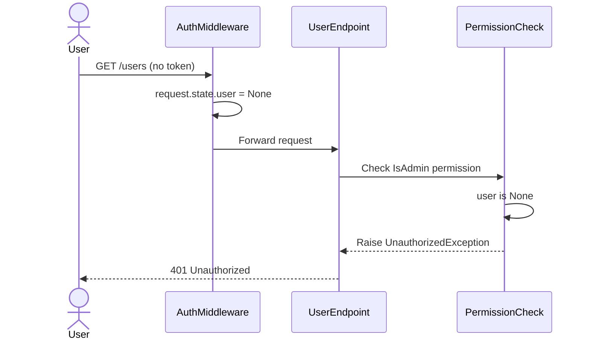
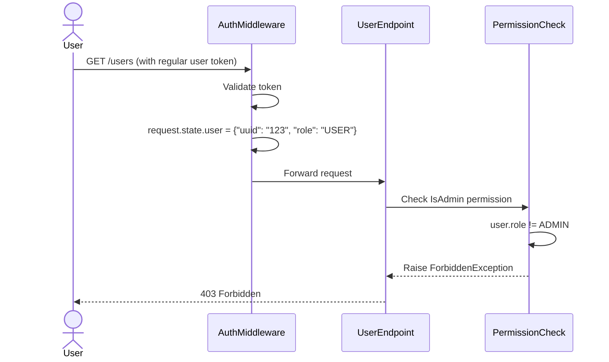
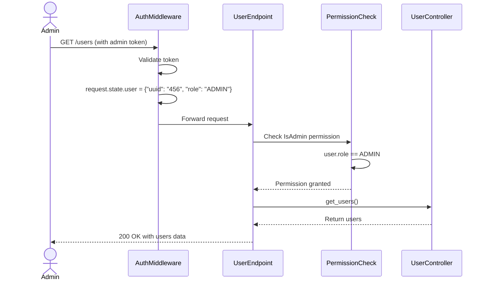
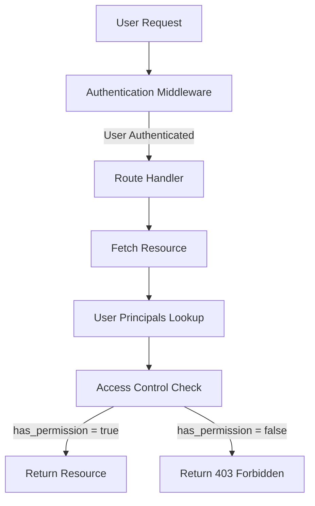
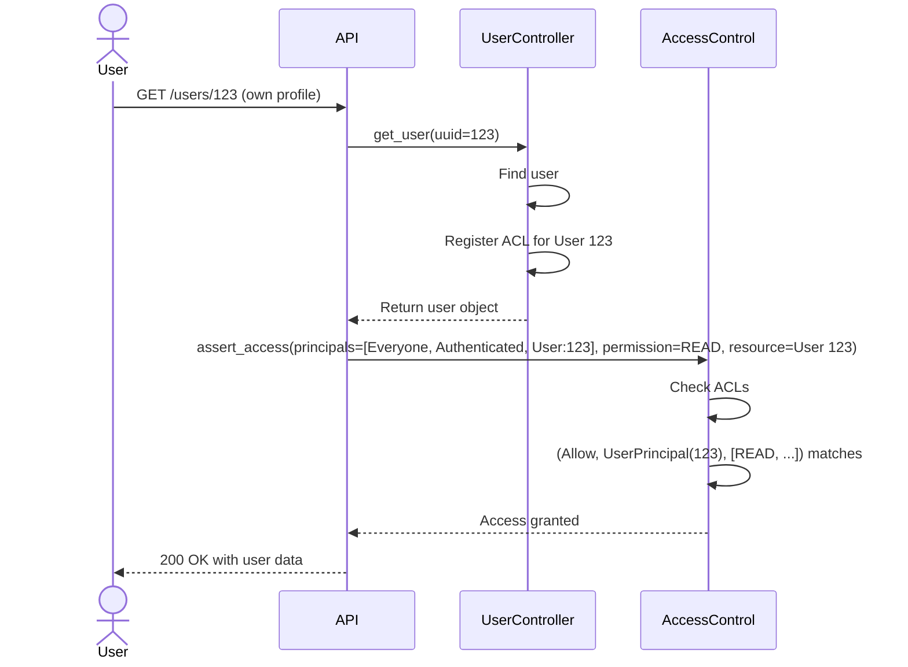
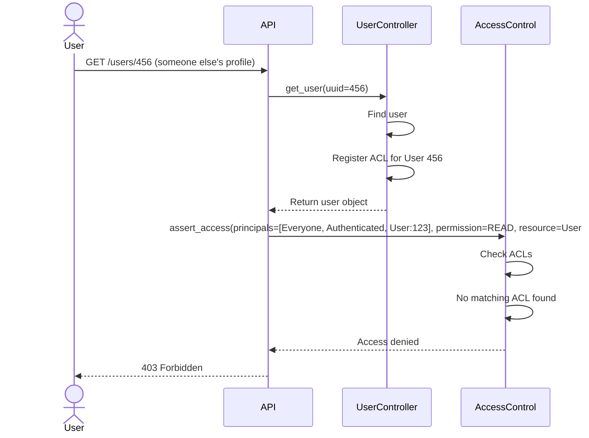
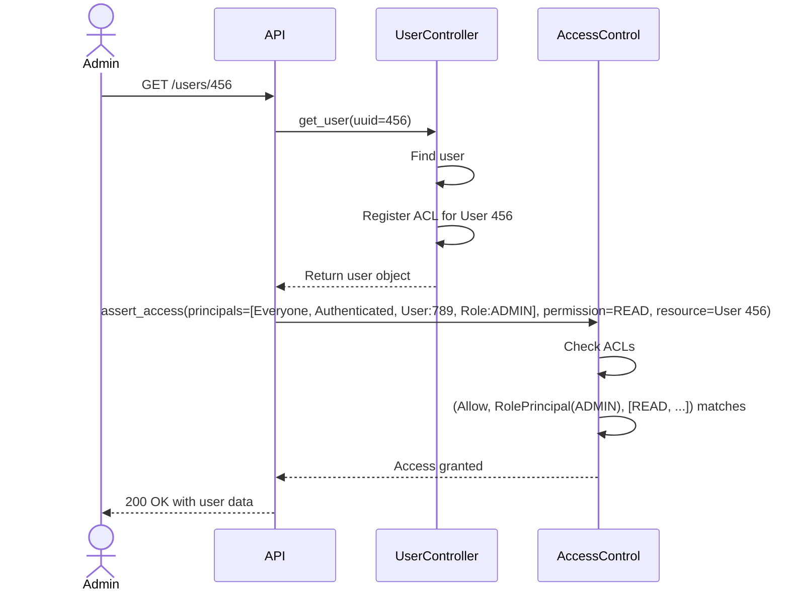

# Authorization

Authorization is a crucial aspect of any application that handles sensitive data or provides different functionality based on user roles. In our system, we've implemented two complementary types of access control:

1. **Identity and Role-Based Access Control**: Authentication and permission checks based on who the user is and what role they have.
2. **Row-Level Permissions**: Fine-grained control over which data records users can access.

This document explains in detail how both types of access control work in our system.

## Type 1: Identity and Role-Based Access Control

Identity and role-based access control focuses on authenticating users and restricting access to certain resources based on their role. This is implemented through a middleware-based approach with custom permission classes.

### 🔄 Authorization Flow

When a user makes a request to our API, it goes through the following flow:



Let's break down each step in detail:

### 1️⃣ Authentication Middleware

The request first passes through the `AuthenticationMiddleware` which attempts to authenticate the user by extracting and validating a JWT token from cookies.

```python
# First, the middleware extracts the token from cookies
token = request.cookies.get("Access-Token")

# If a token exists, it tries to decode and validate it
if token:
    try:
        decoded_token = JWTHandler.decode(token=token)
        user_uuid = decoded_token.get("uuid")
        user_role = decoded_token.get("role")

        # If valid user info is found, attach it to the request state
        if user_uuid and user_role:
            request.state.user = {"uuid": user_uuid, "role": user_role}
        else:
            raise UnauthorizedException(message=_("Invalid token."))
    except Exception as e:
        raise UnauthorizedException(message=_(f"Authentication failed: {str(e)}"))
else:
    # If no token is provided, set user to None
    request.state.user = None
```

#### What happens during authentication:

- If the token is valid, the user's UUID and role are attached to `request.state.user`
- If the token is invalid or malformed, an `UnauthorizedException` is raised
- If no token is provided, `request.state.user` is set to `None` (unauthenticated)

??? tip
    💡 The user information attached to the request is accessible throughout the request's lifecycle and can be used in route handlers and middleware. 

### 2️⃣ Permission Classes

After the authentication middleware, the request reaches a route handler. Route handlers can be protected with permission dependencies to restrict access based on the authenticated user.

Our system defines an extensible hierarchy of permission classes:

1. `BasePermission`: Abstract base class for all permissions
2. `IsAuthenticated`: Checks if the user is authenticated
3. `IsAdmin`: Checks if the user is authenticated AND has the ADMIN role

#### BasePermission

```python
class BasePermission(ABC):
    exception = CustomException

    @abstractmethod
    async def has_permission(self, request: Request) -> bool:
        ...
```

This abstract class defines the interface that all permission classes must implement.

#### IsAuthenticated

```python
class IsAuthenticated(BasePermission):
    exception = UnauthorizedException

    async def has_permission(self, request: Request) -> bool:
        user = request.state.user
        return user is not None and user.get("uuid") is not None
```

This permission checks if the user is authenticated by verifying that the user object exists and has a UUID.

#### IsAdmin

```python
class IsAdmin(IsAuthenticated):
    exception = ForbiddenException

    async def has_permission(self, request: Request) -> bool:
        if not await super().has_permission(request):
            return False

        return request.state.user.get("role") == UserRole.ADMIN
```

This permission extends `IsAuthenticated` and adds an additional check for the ADMIN role.

### 3️⃣ Permission Dependency

The `PermissionDependency` class is used to apply one or more permission checks to a route:

```python
class PermissionDependency(SecurityBase):
    def __init__(self, permissions: list[Type[BasePermission]]):
        self.permissions = permissions
        self.model: APIKeyHeader = APIKeyHeader(name="Authorization")
        self.scheme_name = self.__class__.__name__

    async def __call__(self, request: Request):
        for permission in self.permissions:
            cls = permission()
            if not await cls.has_permission(request=request):
                raise cls.exception
```

When a request is made to a protected route, `PermissionDependency` evaluates each permission class in order. If any permission check fails, it raises the corresponding exception.

### 4️⃣ Applying Permissions to Routes

Permissions are applied to routes using FastAPI's dependency injection system. Here's an example:

```python
@user_router.get("/", dependencies=[Depends(PermissionDependency([IsAdmin]))])
async def get_users(...):
    # Only admin users can access this endpoint
    ...
```

In this example, the `/users` endpoint is protected by the `IsAdmin` permission. Only users with the ADMIN role can access it.

## Example Scenarios

Let's walk through some common scenarios to see how the authorization flow works:

### Scenario 1: Unauthenticated User Accessing Protected Route



### Scenario 2: Regular User Accessing Admin-Only Route



### Scenario 3: Admin User Accessing Admin-Only Route



## Custom Permission Classes

You can create custom permission classes by extending `BasePermission` or any of its subclasses:

```python
class IsProductOwner(IsAuthenticated):
    exception = ForbiddenException

    async def has_permission(self, request: Request) -> bool:
        if not await super().has_permission(request):
            return False
            
        # Get the product ID from the path parameters
        product_id = request.path_params.get("product_id")
        if not product_id:
            return False
            
        # Check if the user owns this product
        # (Implementation would depend on your data access layer)
        user_id = request.state.user.get("uuid")
        return await product_service.is_owner(product_id, user_id)
```

## ⚠️ Important Considerations

1. **Order of Permissions**: Permissions are checked in the order they're provided to `PermissionDependency`. Put the most general checks first for better error messages.

2. **Exceptions**: Different permission classes raise different exceptions:
   - `IsAuthenticated` raises `UnauthorizedException` (401)
   - `IsAdmin` raises `ForbiddenException` (403)

3. **Combining with Row-Level Permissions**: This system can be combined with row-level permissions for more fine-grained access control.

4. **Token Expiration**: JWT tokens have an expiration time. When a token expires, the user will need to re-authenticate.

5. **HTTPS**: Always use HTTPS in production to protect tokens in transit.

## Summary

The identity and role-based access control system in our application follows these key steps:

1. The `AuthenticationMiddleware` authenticates users and attaches their information to the request
2. Permission classes define different access requirements
3. The `PermissionDependency` applies these permissions to routes
4. Route handlers are only executed if all permission checks pass

This system provides a flexible and extensible way to control access to our API endpoints based on user identity and role.

---

# Type 2: Row-Level Permissions

While the Type 1 access control provides a way to restrict access to entire routes based on user roles, Type 2 access control (row-level permissions) allows for much more fine-grained access control at the individual data record level.

## 🔑 Key Concepts

Row-level permissions are built around several key concepts:

1. **Principals**: Identities or roles that can be granted permissions
2. **Access Control Lists (ACLs)**: Rules that define what principals can access which resources
3. **Permissions**: Specific actions that can be performed on a resource

Let's explore each of these concepts and how they work together to provide granular access control.

## 🧩 Principal Types

Principals represent different identities that might need access to resources. Our system defines several types of principals:

```python
# A few examples of principals in our system
Everyone = SystemPrincipal(value="everyone")
Authenticated = SystemPrincipal(value="authenticated")
userA = UserPrincipal(value="user123")
adminRole = RolePrincipal(value="ADMIN")
```

We support these principal types:

| Principal Type | Description | Example |
|----------------|-------------|---------|
| `SystemPrincipal` | System-wide principals | `Everyone`, `Authenticated` |
| `UserPrincipal` | Specific user identities | `UserPrincipal("user123")` |
| `RolePrincipal` | Roles in the system | `RolePrincipal("ADMIN")` |
| `PostPrincipal` | Custom principal for posts | `PostPrincipal("post123")` |
| `ActionPrincipal` | Custom principal for actions | `ActionPrincipal("create")` |

## 🛡️ Access Control Lists (ACLs)

ACLs define what principals can do with specific resources. Each ACL consists of entries with three components:

1. **Action** (`Allow` or `Deny`): Whether to grant or deny access
2. **Principal**: Who is affected by this rule
3. **Permissions**: What actions they can perform

Here's an example ACL from the `User` model:

```python
def __acl__(self):
    basic_permissions = [UserPermission.CREATE]
    self_permissions = [UserPermission.READ, UserPermission.UPDATE, UserPermission.DELETE]
    all_permissions = list(UserPermission)

    return [
        (Allow, Everyone, basic_permissions),
        (Allow, UserPrincipal(str(self.uuid)), self_permissions),
        (Allow, RolePrincipal(UserRole.ADMIN), all_permissions),
    ]
```

This ACL means:

- Everyone can create users
- A user can read, update, and delete their own profile
- Admins can do anything with any user profile

## 🔄 Row-Level Authorization Flow

When a user makes a request to access a specific resource, the following flow is executed:



Let's break down each step in detail:

### 1️⃣ Acquiring User Principals

When a request is processed, the system first needs to determine what principals are associated with the user:

```python
async def get_user_principals(request: Request, user_controller: UserController) -> list[Principal]:
    principals: list[Principal] = [Everyone]

    user_uuid = request.state.user.get("uuid")
    if not user_uuid:
        return principals

    user = await user_controller.get_user(user_uuid=user_uuid)

    principals.append(Authenticated)
    principals.append(UserPrincipal(str(user.uuid)))

    if user.role == UserRole.ADMIN:
        principals.append(RolePrincipal(UserRole.ADMIN))

    return principals
```

This function:

1. Starts with the `Everyone` principal (applies to all requests)
2. If the user is authenticated, adds the `Authenticated` principal
3. Adds a user-specific principal with the user's UUID
4. If the user is an admin, adds the admin role principal

The resulting list of principals will be used to evaluate permissions.

### 2️⃣ Registering Resource ACLs

When a resource is fetched, its ACL is registered in the `ACLRegistry`:

```python hl_lines="6-7"
async def get_user(self, *, user_uuid: UUID4) -> UserResponse:
    user = await self.user_repository.get_by_uuid(uuid=user_uuid)
    if not user:
        raise NotFoundException(message=_("User not found."))

    acl = user.__acl__()
    ACLRegistry.set_acl(resource_id=user.uuid, acl=acl)

    return UserResponse(...)
```

The ACL is either:

- Defined directly on the model via the `__acl__` method
- Retrieved from the `ACLRegistry` if previously stored

!!! question
    Why do we need to put these two highlighted lines in our controllers?
    
    The reason for this is because of the output type of our method. In general, the `_acl` method in the access control expects an object to be passed to it to perform validation on the desired object based on the `__acl__` defined in the model, but in this case our method finally returns UserResponse which is actually a json of the user information. We need to add the access level to this json so that the _acl method can finally control the access levels.

### 3️⃣ Permission Checking

Once we have the user's principals and the resource's ACL, we can check if access should be granted:

```python
# In a route handler:
@user_router.get("/{user_id}", dependencies=[Depends(PermissionDependency([IsAuthenticated]))])
async def get_user(
    user_id: UUID4,
    user_controller: UserController = Depends(Factory().get_user_controller),
    assert_access: Callable = Depends(Permissions(UserPermission.READ)),
) -> APIResponseType[UserResponse]:
    user = await user_controller.get_user(user_uuid=user_id)
    assert_access(resource=user)  # Check if user has READ permission for this resource
    return APIResponse(user)
```

The `assert_access` function is a dependency that checks if the current user has the required permissions for the specified resource.

### 4️⃣ Permission Evaluation Logic

The permission check happens in the `has_permission` method of the `AccessControl` class:

```python
def has_permission(self, principals: List[Principal], required_permissions: Union[str, List[str]], resource: Any) -> bool:
    if not isinstance(resource, list):
        resource = [resource]

    permits = []
    for resource_obj in resource:
        granted = False
        acl = self._acl(resource_obj)

        # Convert required_permissions to list if it's a string
        permissions_list: List[str] = (
            [required_permissions] if isinstance(required_permissions, str) else required_permissions
        )

        for action, principal, permission in acl:
            is_required_permissions_in_permission = any(
                required_permission in permission for required_permission in permissions_list
            )

            if (action == Allow and is_required_permissions_in_permission) and (
                principal in principals or principal == Everyone
            ):
                granted = True
                break
        permits.append(granted)

    return all(permits)
```

This method:

1. Retrieves the ACL for the resource
2. Iterates through ACL entries
3. For each entry, checks if:
   - The action is `Allow`
   - The required permission is in the entry's permission list
   - The principal matches one of the user's principals or is `Everyone`
4. If a match is found, access is granted

## 📝 Example Scenarios

Let's walk through some common scenarios to see how row-level permissions work:

### Scenario 1: User Viewing Their Own Profile



### Scenario 2: User Trying to Access Another User's Profile



### Scenario 3: Admin Accessing Any User's Profile



## 🔧 Creating Custom ACLs

To implement row-level permissions for your models, you need to:

1. Define permissions for your resource:

```python
class PostPermission(StrEnum):
    READ = auto()
    CREATE = auto()
    UPDATE = auto()
    DELETE = auto()
```

2. Implement the `__acl__` method on your model:

```python
class Post(Base, IDUUIDMixin, TimestampMixin):
    __tablename__ = "posts"
    
    title: Mapped[str] = mapped_column(String(200), nullable=False)
    content: Mapped[str] = mapped_column(Text, nullable=False)
    user_id: Mapped[UUID4] = mapped_column(ForeignKey("users.uuid"), nullable=False)
    
    user = relationship("User", back_populates="posts")
    
    def __acl__(self):
        return [
            (Allow, Everyone, [PostPermission.READ]),
            (Allow, UserPrincipal(str(self.user_id)), [PostPermission.UPDATE, PostPermission.DELETE]),
            (Allow, RolePrincipal(UserRole.ADMIN), list(PostPermission)),
        ]
```

3. Register the ACL when retrieving the resource:

```python
async def get_post(self, *, post_uuid: UUID4) -> PostResponse:
    post = await self.post_repository.get_by_uuid(uuid=post_uuid)
    if not post:
        raise NotFoundException(message=_("Post not found."))
    
    acl = post.__acl__()
    ACLRegistry.set_acl(resource_id=post.uuid, acl=acl)
    
    return PostResponse(...)
```

4. Use the permission check in your API route:

```python
@post_router.get("/{post_id}")
async def get_post(
    post_id: UUID4,
    post_controller: PostController = Depends(Factory().get_post_controller),
    assert_access: Callable = Depends(Permissions(PostPermission.READ)),
) -> APIResponseType[PostResponse]:
    post = await post_controller.get_post(post_uuid=post_id)
    assert_access(resource=post)
    return APIResponse(post)
```

## ✅ Advantages of Row-Level Permissions

1. **Fine-grained control**: Control access to individual records rather than entire endpoints
2. **Flexible permission models**: Define complex permission schemes based on multiple factors
3. **Declarative syntax**: Express permissions in a clear, declarative way
4. **Centralized definition**: Keep all permission logic for a resource with the resource itself

## ⚠️ Important Considerations

1. **Performance**: ACL lookups add additional overhead, consider caching strategies for large systems
2. **Complexity**: Row-level permissions add complexity to your codebase, use them only when necessary
3. **Consistency**: Ensure all routes that access a resource properly check permissions
4. **Inheritance**: Consider how permissions should be inherited in hierarchical data models

## 🔄 Combining Both Access Control Types

Our system allows for combining both Types of access control:

1. **Type 1 (Role-based) first**: Use `PermissionDependency([IsAuthenticated])` to check basic route access
2. **Type 2 (Row-level) second**: Use `assert_access(resource=user)` to check specific resource access

This provides a layered approach to security:
- Type 1 prevents unauthorized access to entire routes
- Type 2 ensures users can only access specific records they have permission for

## Summary

The row-level permission system in our application allows for fine-grained access control through:

1. A flexible principal-based architecture
2. Declarative ACLs defined on resources
3. A permission checking system integrated with FastAPI dependencies
4. Support for complex permission scenarios

By combining both Type 1 and Type 2 access controls, our application provides a comprehensive security model that can adapt to a wide range of access control requirements.