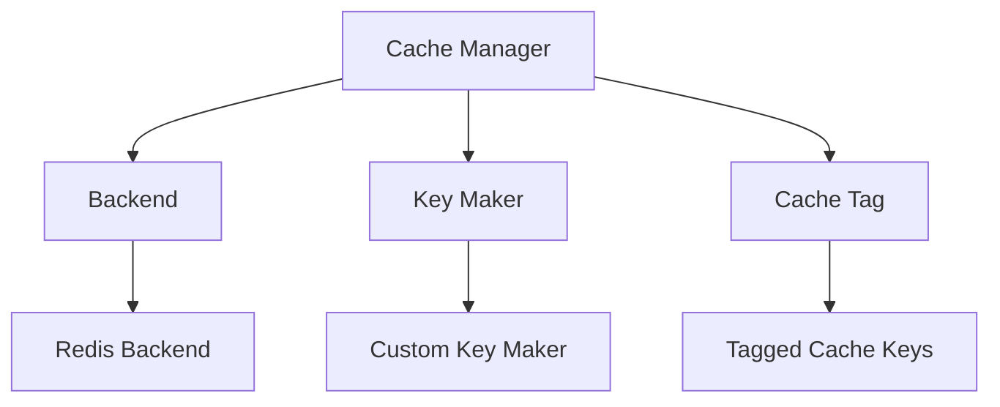

# Cache Module

## Introduction to Caching

### What is Caching?

🔄 **Caching** is a technique used to store copies of frequently accessed data in a high-speed storage layer (the cache) to improve application performance. When data is requested, the system first checks if it exists in the cache. If it does (a cache hit), the data is returned quickly without executing expensive operations like database queries. If not (a cache miss), the system retrieves the data from the original source, stores it in the cache for future requests, and then returns it.

### Benefits of Caching

- **⚡ Improved Performance**: Reduces response times by serving frequently accessed data from memory
- **📊 Reduced Database Load**: Decreases the number of queries sent to your database
- **🔋 Enhanced Scalability**: Allows systems to handle more concurrent users with existing resources
- **💰 Cost Efficiency**: Lowers infrastructure costs by reducing resource usage
- **⏱️ Consistent Response Times**: Provides more predictable performance under varying loads

### Cache Types

1. **Data Cache**: Stores query results, computed values, or serialized objects
2. **HTTP Cache**: Stores HTTP responses based on request parameters
3. **Computed Results Cache**: Stores results of CPU-intensive operations
4. **Session Cache**: Stores user session data for quick access

In this FastAPI application, we use Redis as our caching backend, primarily implementing data and HTTP response caching.

## Cache Architecture

Our caching system is designed with a modular architecture consisting of several components:



### Components

- **Cache Manager**: Orchestrates caching operations through decorators
- **Backend Interface**: Defines the contract for cache storage implementations 
- **Key Maker Interface**: Defines how cache keys are generated
- **Redis Backend**: Implements the Backend interface using Redis
- **Custom Key Maker**: Implements smart key generation based on function signatures
- **Cache Tags**: Enumeration for grouping related cache entries

## Core Components

### Base Backend (`BaseBackend`)

The `BaseBackend` abstract class defines the interface that all cache storage implementations must follow:

```python
class BaseBackend(ABC):
    @abstractmethod
    async def get(self, key: str) -> Any:
        """Retrieve cached value by key"""
        ...

    @abstractmethod
    async def set(self, response: Any, key: str, ttl: int = 60) -> None:
        """Store data in cache with a given TTL"""
        ...

    @abstractmethod
    async def delete_startswith(self, value: str) -> None:
        """Delete all cache entries with keys starting with value"""
        ...
```

This interface allows for different cache storage implementations while maintaining a consistent API.

### Base Key Maker (`BaseKeyMaker`)

The `BaseKeyMaker` abstract class defines how cache keys are generated:

```python
class BaseKeyMaker(ABC):
    @abstractmethod
    async def make(self, function: Callable, prefix: str) -> str:
        """Generate a cache key from function and prefix"""
        ...
```

### Redis Backend (`RedisBackend`)

The `RedisBackend` class implements the `BaseBackend` interface using Redis:

```python
class RedisBackend(BaseBackend):
    async def get(self, key: str, model: Optional[type[BaseModel]] = None) -> Any:
        """Get and optionally deserialize data from Redis"""
        ...

    async def set(self, response: Any, key: str, ttl: int = 60) -> None:
        """Serialize and store data in Redis"""
        ...

    async def delete_startswith(self, value: str) -> None:
        """Delete all Redis keys with the given prefix"""
        ...
```

Key features:

- Supports serializing and deserializing Python objects
- Handles Pydantic models automatically
- Converts UUIDs to strings for proper JSON serialization
- Uses efficient binary serialization

### Custom Key Maker (`CustomKeyMaker`)

The `CustomKeyMaker` class implements intelligent cache key generation:

```python
class CustomKeyMaker(BaseKeyMaker):
    async def make(self, function: Callable, prefix: str) -> str:
        """Generate key based on module, function name, and parameters"""
        ...
```

Key features:

- Generates unique keys based on the function's module path
- Includes function name in the key
- Incorporates parameter names for better uniqueness
- Uses structured key format: `prefix::module::function.parameters`

### Cache Tags (`CacheTag`)

The `CacheTag` enum provides a way to group related cache entries:

```python
class CacheTag(StrEnum):
    GET_USER_LIST = auto()
    # Other tags here...
```

Tags allow for efficient cache invalidation by category rather than individual keys.

### Cache Manager (`CacheManager`)

The `CacheManager` class orchestrates all caching operations:

```python
class CacheManager:
    def __init__(self):
        self.backend: Optional[BaseBackend] = None
        self.key_maker: Optional[BaseKeyMaker] = None
        
    def init(self, *, backend: BaseBackend, key_maker: BaseKeyMaker) -> None:
        """Initialize with backend and key maker"""
        ...
        
    def cached(self, *, prefix: Optional[str] = None, tag: Optional[CacheTag] = None, ttl: int = 60) -> Callable:
        """Decorator to cache function results"""
        ...
        
    def invalidate_by_prefix(self, prefix: str) -> Callable:
        """Decorator to invalidate cache by prefix"""
        ...
        
    def invalidate_by_tag(self, tag: CacheTag) -> Callable:
        """Decorator to invalidate cache by tag"""
        ...
        
    async def remove_by_tag(self, *, tag: CacheTag) -> None:
        """Remove cache entries by tag"""
        ...
        
    async def remove_by_prefix(self, *, prefix: str) -> None:
        """Remove cache entries by prefix"""
        ...
```

## Redis Storage Format

Data is stored in Redis with the following characteristics:

### Key Format

Cache keys follow a structured format to ensure uniqueness and to facilitate grouping related entries:

```
prefix::module_name::function_name.parameter_names
```

For example:

- `users::app.controllers.user_controller::get_user.user_id`
- `GET_USER_LIST::app.controllers.user_controller::list_users.limit_offset`

### Value Format

Values are stored in one of two serialized formats:

1. **JSON (for Pydantic models)**:
   - Serialized using `orjson` for performance
   - UUIDs are converted to strings
   - Nested objects are properly handled

2. **Pickle (for other Python objects)**:
   - Used for complex Python objects that can't be JSON serialized
   - Preserves Python object structure

### TTL (Time-To-Live)

Each cache entry has an expiration time, defined in seconds. When the TTL expires, Redis automatically removes the entry.

## Usage Guide

### Basic Setup

To set up the cache system in your FastAPI application:

```python title="server.py"
def init_cache() -> None:
    """
    Initializes the caching system using Redis backend.
    """
    Cache.init(backend=RedisBackend(), key_maker=CustomKeyMaker())


def create_app() -> FastAPI:
    """
    Creates and configures the FastAPI application.

    Returns:
        FastAPI: The configured FastAPI app instance.
    """
    app_ = FastAPI(
        # Other config
    )
    init_cache()
    return app_
```

### Caching Endpoint Results

To cache the results of an endpoint:

```python
from core.cache import Cache

@router.get("/users/{user_id}")
@Cache.cached(prefix="users", ttl=60)  # Cache for 60 seconds
async def get_user(user_id: str):
    # This result will be cached
    return await user_service.get_user(user_id)
```

### Using Cache Tags

For better organization, you can use cache tags instead of prefixes:

```python
from core.cache import Cache
from core.cache.cache_tag import CacheTag

@router.get("/users")
@Cache.cached(tag=CacheTag.GET_USER_LIST, ttl=300)  # Cache for 5 minutes
async def list_users():
    return await user_service.list_users()
```

### Cache Invalidation

When data changes, you need to invalidate related cache entries:

```python
# Invalidate by prefix
@router.post("/users")
@Cache.invalidate_by_prefix(prefix="users")
async def create_user(user_data: UserCreate):
    return await user_service.create_user(user_data)

# Invalidate by tag
@router.put("/users/{user_id}")
@Cache.invalidate_by_tag(tag=CacheTag.GET_USER_LIST)
async def update_user(user_id: str, user_data: UserUpdate):
    return await user_service.update_user(user_id, user_data)
```

### Programmatic Cache Invalidation

Sometimes you need to invalidate cache outside of route handlers:

```python
# In a service or controller
async def process_mass_user_update():
    # Business logic...
    
    # Then invalidate cache
    await Cache.remove_by_prefix(prefix="users")
    await Cache.remove_by_tag(tag=CacheTag.GET_USER_LIST)
```

## When to Invalidate Cache

Cache invalidation is necessary when the underlying data changes. Here are guidelines for when to invalidate cache:

### Always Invalidate On:

- **Create Operations**: When new resources are created that would affect list views
- **Update Operations**: When existing resources are modified
- **Delete Operations**: When resources are removed
- **Batch Operations**: When multiple resources are modified at once

### Example Endpoints That Should Invalidate Cache:

```python
# Creating a new user invalidates user lists
@router.post("/users/")
@Cache.invalidate_by_tag(tag=CacheTag.GET_USER_LIST)
async def create_user(user_data: UserCreate):
    ...

# Updating a user invalidates both specific user and list caches
@router.put("/users/{user_id}")
@Cache.invalidate_by_prefix(prefix="users")  # Invalidates all user caches
async def update_user(user_id: str, user_data: UserUpdate):
    ...

# Deleting a user invalidates both specific user and list caches
@router.delete("/users/{user_id}")
@Cache.invalidate_by_prefix(prefix="users")  # Invalidates all user caches
async def delete_user(user_id: str):
    ...
```

## When NOT to Invalidate Cache

Not all operations require cache invalidation:

- **Read-only Operations**: Operations that don't modify data
- **Private User Data**: Data specific to a user that doesn't affect other users
- **Computed Results**: Results of calculations that don't depend on database state
- **Static Content**: Content that rarely changes

## Cache Customization

### Custom TTL Values

Adjust the TTL based on data volatility:

```python
# Frequently changing data: shorter TTL
@Cache.cached(prefix="stock_prices", ttl=30)  # 30 seconds

# Rarely changing data: longer TTL
@Cache.cached(prefix="country_list", ttl=86400)  # 24 hours
```

### Creating Custom Backend

If you need to use a different cache store (like Memcached), create a custom backend:

```python
from core.cache.base import BaseBackend

class MemcachedBackend(BaseBackend):
    def __init__(self, client):
        self.client = client
        
    async def get(self, key: str) -> Any:
        # Implement Memcached get
        ...
        
    async def set(self, response: Any, key: str, ttl: int = 60) -> None:
        # Implement Memcached set
        ...
        
    async def delete_startswith(self, value: str) -> None:
        # Implement prefix deletion logic
        ...
```

### Creating Custom Key Maker

For specialized key generation logic:

```python
from core.cache.base import BaseKeyMaker

class RequestBasedKeyMaker(BaseKeyMaker):
    async def make(self, function: Callable, prefix: str) -> str:
        # Generate keys based on request parameters
        # Could include user ID, permissions, etc.
        ...
```

## Performance Considerations

### Optimal TTL Settings

The Time-To-Live (TTL) setting is crucial for balancing performance with data freshness:

| Data Type | Suggested TTL | Rationale |
|-----------|---------------|-----------|
| User profiles | 300-600s | Moderate change frequency |
| List views | 60-120s | May change frequently |
| Reference data | 3600-86400s | Rarely changes |
| Real-time data | 10-30s | Changes very frequently |

### Cache Key Design

- **Keep keys short**: Long keys increase memory usage
- **Use structured keys**: Makes invalidation easier
- **Include relevant parameters**: But avoid over-specificity that defeats caching

### Memory Management

Redis uses memory for storage, so monitor memory usage:

- Set a maximum memory policy in Redis (`maxmemory` and `maxmemory-policy`)
- Consider using Redis eviction policies like `volatile-lru` (Least Recently Used)
- Monitor cache hit/miss ratios to optimize TTL values

## Best Practices

### Do's

- ✅ **Cache read-heavy data**: Prioritize caching for frequently accessed, rarely changing data
- ✅ **Use appropriate TTLs**: Balance freshness with performance
- ✅ **Implement invalidation strategies**: Keep cache consistent with your data
- ✅ **Monitor cache performance**: Track hit rates and memory usage
- ✅ **Handle cache failures gracefully**: Your app should work even if Redis is down

### Don'ts

- ❌ **Don't cache everything**: Be selective about what you cache
- ❌ **Don't set extremely long TTLs**: Without proper invalidation
- ❌ **Don't ignore cache invalidation**: Stale data leads to bugs
- ❌ **Don't serialize huge objects**: Cache reasonably sized data
- ❌ **Don't store sensitive data**: Unless properly encrypted

## Complete Example

Here's a complete example showing how to use the cache system in a user service:

```python
from fastapi import APIRouter, Depends, status
from pydantic import UUID4
from typing import Callable, List

from core.cache import Cache
from core.cache.cache_tag import CacheTag
from core.responses import APIResponse, APIResponseType
from core.security import IsAuthenticated, PermissionDependency, Permissions, UserPermission
from services import UserController
from models import UserResponse, RegisterUserRequest

user_router = APIRouter()
prefix = "users"

# Read operation - cached
@user_router.get("/{user_id}", dependencies=[Depends(PermissionDependency([IsAuthenticated]))])
@Cache.cached(prefix=prefix, ttl=60)  # Cache for 60 seconds
async def get_user(
    user_id: UUID4,
    user_controller: UserController = Depends(Factory().get_user_controller),
    assert_access: Callable = Depends(Permissions(UserPermission.READ)),
) -> APIResponseType[UserResponse]:
    """Get details of a specific user by ID."""
    user = await user_controller.get_user(user_uuid=user_id)
    assert_access(resource=user)
    return APIResponse(user)

# List operation - cached with tag
@user_router.get("/", dependencies=[Depends(PermissionDependency([IsAuthenticated]))])
@Cache.cached(tag=CacheTag.GET_USER_LIST, ttl=30)  # Shorter TTL for lists
async def list_users(
    user_controller: UserController = Depends(Factory().get_user_controller),
) -> APIResponseType[List[UserResponse]]:
    """List all users."""
    users = await user_controller.list_users()
    return APIResponse(users)

# Write operation - invalidates cache
@user_router.post("/", status_code=status.HTTP_201_CREATED)
@Cache.invalidate_by_prefix(prefix=prefix)  # Invalidate all user caches
@Cache.invalidate_by_tag(tag=CacheTag.GET_USER_LIST)  # Also invalidate list cache
async def register_user(
    register_user_request: RegisterUserRequest,
    user_controller: UserController = Depends(Factory().get_user_controller),
) -> APIResponseType[UserResponse]:
    """Register a new user."""
    user = await user_controller.register_user(register_user_request=register_user_request)
    return APIResponse(user)

# Update operation - invalidates cache
@user_router.put("/{user_id}", dependencies=[Depends(PermissionDependency([IsAuthenticated]))])
@Cache.invalidate_by_prefix(prefix=prefix)  # Invalidate all user caches
@Cache.invalidate_by_tag(tag=CacheTag.GET_USER_LIST)  # Also invalidate list cache
async def update_user(
    user_id: UUID4,
    user_data: UserUpdateRequest,
    user_controller: UserController = Depends(Factory().get_user_controller),
    assert_access: Callable = Depends(Permissions(UserPermission.WRITE)),
) -> APIResponseType[UserResponse]:
    """Update an existing user."""
    user = await user_controller.get_user(user_uuid=user_id)
    assert_access(resource=user)
    updated_user = await user_controller.update_user(user_uuid=user_id, user_data=user_data)
    return APIResponse(updated_user)
```

## Conclusion

The caching system in this FastAPI application provides a flexible, efficient way to improve performance by reducing database load. By using Redis as a backend and providing clear abstractions through the `BaseBackend` and `BaseKeyMaker` interfaces, the system is both powerful and extensible.

Key points to remember:
- Cache read-heavy data to improve performance
- Use appropriate TTLs based on data volatility
- Always invalidate cache when underlying data changes
- Monitor cache performance and adjust strategy as needed

By following these guidelines, you can significantly improve your application's performance while ensuring data consistency.