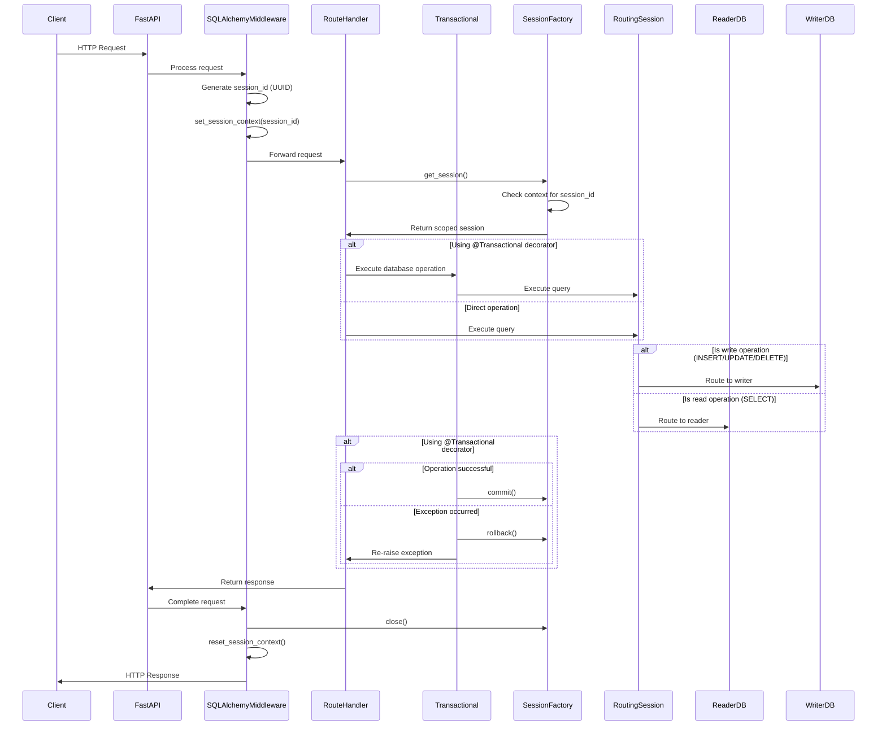

# Database Module

## Overview

The database module implements a robust system for database operations using SQLAlchemy's async capabilities. It provides:

- **Asynchronous database connectivity** with reader/writer routing
- **Session context management** using Python's contextvars
- **Transaction management** with automatic commit/rollback
- **Common database model mixins** for standardized field patterns
- **Request-scoped session handling** using middleware

This documentation explores how these components work together to provide a clean, efficient database interface.

## Database Connection Architecture

### Read/Write Splitting Pattern

The system implements a read/write splitting pattern, where:

- **Read operations** (SELECT queries) are directed to a reader database
- **Write operations** (INSERT, UPDATE, DELETE) are directed to a writer database

This architecture supports high-performance applications by:

- Allowing read-heavy workloads to be distributed
- Ensuring write operations are properly isolated
- Supporting potential database replication setups

While both engines currently point to the same database URL, this design allows for easy separation in the future by simply changing the configuration.

### Connection Pool Management

Database connections are managed via connection pools with the following configurable parameters:

- `pool_recycle`: Maximum age of connections before recycling
- `max_overflow`: Maximum extra connections beyond pool size
- `pool_size`: Default pool size
- `pool_timeout`: Timeout for obtaining a connection from the pool

These settings help optimize resource usage and ensure connection stability in production environments.

## Session Management

### Context Variables for Session Isolation

The system uses Python's `contextvars` to maintain isolated session contexts across async operations. This solves a critical problem in asynchronous environments where traditional thread-local storage would not work properly.

When a request arrives:

1. A unique session ID is generated
2. This ID is stored in the context variable
3. The scoped session factory uses this ID to create or retrieve the appropriate session
4. After request processing, the context is reset

This ensures that even with concurrent requests, each request gets its own isolated database session.

### Scoped Session Factory

The `async_scoped_session` factory creates session instances tied to the current context. This means:

- Each unique context (request) gets its own session
- Sessions are automatically retrieved based on context
- Sessions are properly isolated between different requests
- Session lifecycle is tied to the request lifecycle

### Session Routing Logic

The `RoutingSession` class makes intelligent decisions about which database engine to use:

- During flush operations or explicit write operations (UPDATE, DELETE, INSERT), the writer engine is used
- For all other operations (typically SELECT queries), the reader engine is used

This happens automatically without requiring developers to specify which engine to use for each query.

## Transaction Management

### The Transactional Decorator

The `Transactional` decorator wraps methods to ensure they execute within a transaction. When a method is decorated with `@Transactional()`:

1. The method executes normally
2. If successful, the transaction is committed
3. If an exception occurs, the transaction is rolled back and the exception is re-raised

This pattern ensures data integrity by either completing all operations or none of them.

### Automatic Session Closure

The session is automatically closed after request processing through:

1. The `get_session` dependency which yields a session and then closes it
2. The `SQLAlchemyMiddleware` which ensures session closure in its `finally` block

This prevents resource leaks and ensures database connections are properly returned to the pool.

## Request-Level Session Handling

### Middleware Integration

The `SQLAlchemyMiddleware` class handles session context at the request level:

1. When a request arrives, a unique session ID (UUID) is generated
2. This ID is set in the context using `set_session_context`
3. After request processing (including any exceptions), the session is closed
4. The context is reset to its previous state

This middleware ensures proper isolation between requests and prevents session leakage.

### Dependency Injection Pattern

The `get_session` function provides a clean way to inject the database session into route handlers:

```python
async def some_route_handler(db: AsyncSession = Depends(get_session)):
    # Use db for database operations
    ...
```

This pattern:

- Ensures consistent session usage across route handlers
- Handles proper session closure automatically
- Makes testing easier by allowing session mocking

## Model Building Blocks

### Base Model

The `Base` class serves as the foundation for all database models using SQLAlchemy's declarative system. All models inherit from this base class, ensuring consistent configuration.

### Identifier Mixins

Three mixins provide standardized identifier patterns:

1. **IDMixin**: Adds an auto-incrementing integer primary key
   - Useful for internal references and foreign keys
   - Optimized for database performance

2. **UUIDMixin**: Makes a UUID field the primary key
   - Provides globally unique identifiers
   - Better for distributed systems and public APIs
   - Indexed for performance

3. **IDUUIDMixin**: Combines both approaches
   - Uses an auto-incrementing ID as the actual primary key
   - Adds a UUID field that's indexed and unique
   - Balances database performance with distributed system requirements

### Timestamp Tracking

The `TimestampMixin` adds automatic timestamp tracking:

- `created`: Set automatically when a record is created
- `updated`: Updated automatically whenever a record changes
- `deleted`: Nullable field to support soft deletion patterns

This provides built-in auditing capabilities for all models that use this mixin.

## Lifecycle of a Database Operation

To understand how all these components work together, let's follow the lifecycle of a typical database operation:



### Detailed Step-by-Step Process:

1. **Request Arrival**:
   - `SQLAlchemyMiddleware` generates a unique session ID
   - This ID is stored in the context variable

2. **Route Handler Execution**:
   - Route handler receives a session via dependency injection
   - The session is scoped to the current request context

3. **Database Operation**:
   - If using the `@Transactional()` decorator, a transaction is started
   - The appropriate engine (reader/writer) is selected based on operation type
   - The operation is executed against the database

4. **Transaction Completion**:
   - If using `@Transactional()`, success leads to commit, failure to rollback
   - Otherwise, explicit commit/rollback is needed

5. **Request Completion**:
   - Session is automatically closed
   - Context is reset to previous state

This lifecycle ensures proper isolation, resource management, and transaction handling.

## Best Practices

### When to Use Transactions

- Use the `@Transactional()` decorator for methods that perform multiple related database operations
- Consider using explicit transactions for complex operations with conditional logic
- Remember that transactions are not needed for single read operations

### Working with Models

- Always inherit from `Base` for all database models
- Use the appropriate mixins based on your identifier and timestamp tracking needs
- Consider using composite patterns, e.g., `class User(Base, IDUUIDMixin, TimestampMixin):`

### Session Management

- Use the dependency injection pattern with `get_session()` for consistent session handling
- Avoid creating your own sessions outside this pattern
- Remember that sessions are automatically scoped to the current request

### Read/Write Operations

- Trust the routing system to direct operations to the appropriate engine
- For complex queries, be aware of whether they'll be routed as read or write operations
- Consider explicitly starting transactions for critical write operations

## Advanced Concepts

### Soft Deletion Pattern

The `TimestampMixin` includes a `deleted` field that supports a soft deletion pattern:

- Instead of actually removing records, set the `deleted` timestamp
- Filter queries to exclude records with a non-null `deleted` value
- This preserves data for auditing while behaving like deletion to users

### UUID vs. Integer IDs

The system supports both UUID and integer ID strategies:

- Integer IDs are more efficient for internal database operations
- UUIDs are safer for public APIs and distributed systems
- The `IDUUIDMixin` provides a compromise that offers both benefits

### Connection Pool Optimization

Connection pool settings should be tuned based on:

- Expected concurrent users
- Database server capacity
- Operation complexity and duration
- Server resources

---

✨ By leveraging this robust database architecture, your application achieves proper separation of concerns, resource management, and operational efficiency while maintaining developer-friendly patterns.
