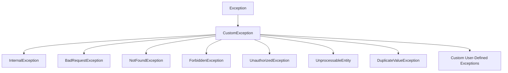

# Exception Module

## Introduction

🚨 The Exception Module provides a standardized way to handle errors in your application by mapping them to appropriate HTTP status codes. This ensures consistency in error reporting across your API and simplifies error handling.

The module is designed with the following principles:

- 🔄 **Consistency**: All exceptions follow the same structure
- 🌐 **HTTP Alignment**: Each exception maps directly to an HTTP status code
- 📝 **Customizable Messages**: Default messages can be overridden
- 🧩 **Extensibility**: Easy to create new exception types

## Exception Hierarchy

The exception hierarchy is structured to provide a clear relationship between different error types:



## Built-in Exceptions

### CustomException

`CustomException` is the base class for all other exceptions in the module. It provides the fundamental structure and behavior that other exceptions inherit.

**Attributes:**

- `code`: HTTP status code (default: `HTTPStatus.BAD_GATEWAY`)
- `error_code`: Error code for the client (default: `HTTPStatus.BAD_GATEWAY`)
- `message`: Human-readable error message (default: `HTTPStatus.BAD_GATEWAY.description`)

**Usage:**
```python
from app.exceptions import CustomException

# Using the default message
raise CustomException()

# Providing a custom message
raise CustomException(message="A custom error message")
```

### InternalException

Used for internal server errors (HTTP 500).

**Attributes:**

- `code`: `HTTPStatus.INTERNAL_SERVER_ERROR` (500)
- `error_code`: `HTTPStatus.INTERNAL_SERVER_ERROR` (500)
- `message`: "Internal Server Error"

**Usage:**
```python
from app.exceptions import InternalException

# Using the default message
raise InternalException()

# Providing a custom message
raise InternalException(message="Database connection failed")
```

### BadRequestException

Used when the client sends an invalid request (HTTP 400).

**Attributes:**

- `code`: `HTTPStatus.BAD_REQUEST` (400)
- `error_code`: `HTTPStatus.BAD_REQUEST` (400)
- `message`: "Bad Request"

**Usage:**
```python
from app.exceptions import BadRequestException

# Using the default message
raise BadRequestException()

# Providing a custom message
raise BadRequestException(message="Invalid request parameters")
```

### NotFoundException

Used when a requested resource cannot be found (HTTP 404).

**Attributes:**

- `code`: `HTTPStatus.NOT_FOUND` (404)
- `error_code`: `HTTPStatus.NOT_FOUND` (404)
- `message`: "Not Found"

**Usage:**
```python
from app.exceptions import NotFoundException

# Using the default message
raise NotFoundException()

# Providing a custom message
raise NotFoundException(message="User not found")
```

### ForbiddenException

Used when a client doesn't have permission to access a resource (HTTP 403).

**Attributes:**

- `code`: `HTTPStatus.FORBIDDEN` (403)
- `error_code`: `HTTPStatus.FORBIDDEN` (403)
- `message`: "Forbidden"

**Usage:**
```python
from app.exceptions import ForbiddenException

# Using the default message
raise ForbiddenException()

# Providing a custom message
raise ForbiddenException(message="You don't have access to this resource")
```

### UnauthorizedException

Used when authentication is required but was not provided or is invalid (HTTP 401).

**Attributes:**

- `code`: `HTTPStatus.UNAUTHORIZED` (401)
- `error_code`: `HTTPStatus.UNAUTHORIZED` (401)
- `message`: "Unauthorized"

**Usage:**
```python
from app.exceptions import UnauthorizedException

# Using the default message
raise UnauthorizedException()

# Providing a custom message
raise UnauthorizedException(message="Invalid credentials")
```

### UnprocessableEntity

Used when the server understands the content type but cannot process the request (HTTP 422).

**Attributes:**

- `code`: `HTTPStatus.UNPROCESSABLE_ENTITY` (422)
- `error_code`: `HTTPStatus.UNPROCESSABLE_ENTITY` (422)
- `message`: "Unprocessable Entity"

**Usage:**
```python
from app.exceptions import UnprocessableEntity

# Using the default message
raise UnprocessableEntity()

# Providing a custom message
raise UnprocessableEntity(message="Invalid data format")
```

### DuplicateValueException

Used when an operation fails due to a duplicate value, such as a unique constraint violation (HTTP 422).

**Attributes:**

- `code`: `HTTPStatus.UNPROCESSABLE_ENTITY` (422)
- `error_code`: `HTTPStatus.UNPROCESSABLE_ENTITY` (422)
- `message`: "Unprocessable Entity"

**Usage:**
```python
from app.exceptions import DuplicateValueException

# Using the default message
raise DuplicateValueException()

# Providing a custom message
raise DuplicateValueException(message="Email address already exists")
```

## Using Exceptions

### Using Predefined Exceptions

The module provides several predefined exceptions that cover common HTTP error scenarios. Here's an example of using one of these exceptions in a service method:

```python
from uuid import UUID
from app.exceptions import NotFoundException
from app.schemas import UserResponse

async def get_user(self, *, user_uuid: UUID) -> UserResponse:
    """
    Retrieves a user by their UUID.

    Args:
        user_uuid (UUID): Unique identifier of the user.

    Returns:
        UserResponse: User data.

    Raises:
        NotFoundException: If user does not exist.
    """
    user = await self.user_repository.get_by_uuid(uuid=user_uuid)
    if not user:
        raise NotFoundException(message=_("User not found."))  # Custom message with i18n support

    return UserResponse(
        uuid=user.uuid,
        email=user.email,
        first_name=user.first_name,
        last_name=user.last_name,
        role=user.role,
        activated=user.activated,
    )
```

??? tip
    Use the `_()` function for internationalization (i18n) support in your error messages.

### Creating Custom Exceptions

You can create custom exceptions by inheriting from `CustomException` and setting the appropriate code, error_code, and default message.

**Example: Creating JWT-related exceptions**

```python
from app.exceptions import CustomException
from fastapi import status

class JWTDecodeError(CustomException):
    """Exception raised when JWT token decoding fails due to invalid token."""

    code = status.HTTP_401_UNAUTHORIZED
    error_code = status.HTTP_401_UNAUTHORIZED
    message = _("Invalid token.")


class JWTExpiredError(CustomException):
    """Exception raised when a JWT token has expired."""

    code = status.HTTP_401_UNAUTHORIZED
    error_code = status.HTTP_401_UNAUTHORIZED
    message = _("Token expired.")
```

**Using your custom exception:**

```python
import jwt
from app.exceptions import JWTDecodeError, JWTExpiredError

def decode_token(token: str) -> dict:
    try:
        return jwt.decode(token, SECRET_KEY, algorithms=["HS256"])
    except jwt.exceptions.DecodeError:
        raise JWTDecodeError()
    except jwt.exceptions.ExpiredSignatureError:
        raise JWTExpiredError()
```

## Best Practices

🔄 **Be Specific**: Use the most specific exception type that applies to the situation.

```python
# ❌ Less specific
if not user:
    raise CustomException(message="User not found")

# ✅ More specific
if not user:
    raise NotFoundException(message="User not found")
```

📝 **Provide Clear Messages**: Always include a descriptive message that explains what went wrong.

```python
# ❌ Default message may be too generic
raise NotFoundException()

# ✅ Clear, specific message
raise NotFoundException(message="User with ID 123 was not found")
```

🌐 **Support i18n**: Use the translation function for messages to support internationalization.

```python
# ❌ No translation support
raise BadRequestException(message="Invalid email format")

# ✅ With translation support
raise BadRequestException(message=_("Invalid email format"))
```

🧩 **Extend Thoughtfully**: Create new exception types only when they represent a truly different error scenario.

```python
# ❌ Unnecessary new exception type
class UserNotFoundException(CustomException):
    code = HTTPStatus.NOT_FOUND
    error_code = HTTPStatus.NOT_FOUND
    message = "User not found"

# ✅ Use existing exception with custom message
raise NotFoundException(message="User not found")
```

📚 **Document Exceptions**: Always document which exceptions a function might raise.

```python
def get_user(user_id: int) -> User:
    """
    Get a user by ID.
    
    Args:
        user_id: The user's ID
        
    Returns:
        User object
        
    Raises:
        NotFoundException: If the user does not exist
        UnauthorizedException: If the current user doesn't have permission to view this user
    """
```

## Integration with FastAPI

To integrate your exception module with FastAPI, you can create an exception handler that converts your custom exceptions into consistent API responses:

```python
from fastapi import FastAPI, Request
from fastapi.responses import JSONResponse
from app.exceptions import CustomException

app = FastAPI()

def init_listeners(app_: FastAPI) -> None:
    """
    Registers exception handlers or event listeners.

    Args:
        app_ (FastAPI): The FastAPI application instance.
    """

    @app_.exception_handler(CustomException)
    async def custom_exception_handler(request: Request, exc: CustomException):
        return ORJSONResponse(
            status_code=exc.code,
            content={
                "header": {"status": ResponseStatus.FAILURE, "message": exc.message, "code": exc.error_code},
                "content": None,
            },
        )
```

This handler will convert any `CustomException` (or its subclasses) into a standardized JSON response:

```json
{
  "header": {
    "status": "success",
    "message": "Operation completed successfully.",
    "code": 200
  },
  "content": ...
}
```

??? tip
    You can also log exceptions in your exception handler for better debugging and monitoring.

---

By using this exception module, you ensure consistent error handling throughout your application while maintaining the flexibility to provide specific error messages for different scenarios.