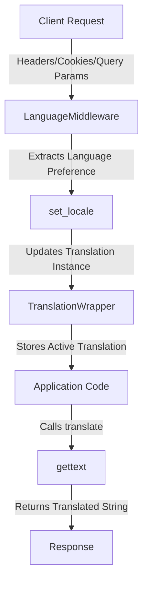

# Internationalization (i18n)

## Introduction to i18n

🌍 **Internationalization (i18n)** is the process of designing and developing software applications to support multiple languages and regional preferences. The term "i18n" comes from the first and last letters of "internationalization" and the 18 letters in between.

Key benefits of i18n:

- 🌐 Expand your user base to global audiences
- 🤝 Improve user experience by providing content in their preferred language
- 🚀 Enhance application accessibility
- 📈 Increase user engagement and satisfaction

Our implementation in this FastAPI project provides a robust framework for translating application text into multiple languages based on user preferences detected from HTTP requests.

## Implementation Overview

This project implements i18n using Python's built-in `gettext` module, which is a standard approach for internationalization. The implementation follows these key principles:

- **Singleton Pattern**: A `TranslationWrapper` class that ensures consistent translation behavior throughout the application
- **Middleware-based**: Language detection and setting via FastAPI middleware
- **Multiple Detection Methods**: Language preferences are detected from query parameters, cookies, or HTTP headers
- **Variable Interpolation**: Support for dynamic content within translated strings

## Project Structure

The i18n implementation consists of the following components:

```
project/
├── core/
│   └── i18n/
│       ├── base.py         # Core translation functions
│       └── language.py     # Middleware for language detection
├── translations/
│   ├── fa/                 # Persian language
│   │   └── LC_MESSAGES/
│   │       ├── messages.mo # Compiled translation file
│   │       └── messages.po # Human-readable translation file
│   └── messages.pot        # Template file with all translatable strings
└── babel.cfg               # Configuration for Babel extraction
```

## Translation Flow



When a user sends a request to your FastAPI application, the following process occurs:

1. 📥 **Request Received**: The client makes a request to your API
2. 🔍 **Language Detection**: The `LanguageMiddleware` intercepts the request
3. 🌐 **Locale Setting**: The `set_locale` function determines the preferred language from:
   - `?lang=` query parameter (highest priority)
   - `Accept-Language` cookie (medium priority)
   - `Accept-Language` HTTP header (lowest priority)
4. 🔄 **Translation Setup**: The `TranslationWrapper` singleton is updated with the correct language
5. 💬 **String Translation**: Application code calls `translate()` or `_()` functions with message strings
6. 📤 **Response Delivery**: Translated content is included in the response

## Setup and Configuration

To set up i18n in your FastAPI project:

1. **Install Required Dependencies**:
   ```bash
   uv add babel
   ```

2. **Create a Babel Configuration File** (`babel.cfg`):
   ```ini
   [python: **.py]
   encoding = utf-8
   ```

3. **Add Middleware to Your FastAPI App**:
   ```python
   from core.i18n.language import LanguageMiddleware
   
   app = FastAPI()
   app.add_middleware(LanguageMiddleware)
   ```

4. **Initialize Translation Directory**:
   ```bash
   mkdir -p translations
   uv run pybabel extract -F babel.cfg -o translations/messages.pot .
   ```

5. **Create the `.po` Files for the Languages You Want to Support**:
    ```bash
    uv run pybabel init -i translations/messages.pot -d translations -l fa
    uv run pybabel init -i translations/messages.pot -d translations -l de
    ```

6. **Compile the `.po` Files Into `.mo` Files**:
    ```bash
    uv run pybabel compile -d translations
    ```

## Usage Guide

### Basic Translation

To translate a string in your application:

```python
from core.i18n.base import translate

# Option 1: Using the translate function
translated_text = translate("Hello, world!")

# Option 2: Using the shorthand _ function (if installed)
from core.i18n.base import translate as _
translated_text = _("Hello, world!")
```

#### Real-world Example from Your Code:

```python
async def register_user(self, *, register_user_request: RegisterUserRequest) -> UserResponse:
    user = await self.user_repository.get_by_email(email=register_user_request.email)
    if user:
        raise BadRequestException(message=_("User already exists with this email."))
    
    # Rest of the function...
```

In this example, the error message is translated based on the user's language preference.

### Translation with Variables

For dynamic content, use the `translate_with_variables` function:

```python
from core.i18n.base import translate_with_variables

# Example with variables
username = "Alice"
count = 5
message = translate_with_variables(
    "Hello, {username}! You have {count} new messages.",
    username=username,
    count=count
)
```

#### Example from Your Code:

```python
@user_router.get("test/")
async def test():
    a = 20
    b = "test str"

    # Use translate_with_variables to handle dynamic placeholders
    return {"message": translate_with_variables("a equals {a} and b equals {b}", a=a, b=b)}
```

When this endpoint is called:

- With English as the preferred language: `"a equals 20 and b equals test str"`
- With Persian as the preferred language (assuming translation exists): `"a برابر است با 20 و b برابر است با test str"`

#### How Variable Translation Works:

1. The base message is extracted and appears in the `messages.pot` file:
   ```
   #: app/api/test.py:10
   msgid "a equals {a} and b equals {b}"
   msgstr ""
   ```

2. Translators provide translations while preserving the placeholders:
   ```
   # German example
   msgid "a equals {a} and b equals {b}"
   msgstr "a برابر است با 20 و b برابر است با test str"
   ```

3. At runtime, the placeholders are replaced with the actual values.

??? warning
    Placeholders must be preserved exactly as they appear in the original string. The position can change to match the grammar of the target language, but the names must remain the same.

## Working with Translation Files

### Understanding Translation Files

The i18n workflow uses three types of files:

1. **POT (Portable Object Template) Files** (`.pot`): 
   - Template files containing all extractable strings from your code
   - Generated by scanning the source code for translatable strings
   - Acts as a starting point for creating translations

2. **PO (Portable Object) Files** (`.po`):
   - Human-readable files containing source strings and their translations
   - One file per language
   - Edited by translators to provide translations for each string

3. **MO (Machine Object) Files** (`.mo`):
   - Binary, compiled versions of PO files
   - Used at runtime by the application
   - Generated from PO files using the `pybabel compile` command

### Adding New Translations

When adding new translatable strings to your application, follow this workflow to preserve existing translations:

1. **Extract New Messages**:
   ```bash
   uv run pybabel extract -F babel.cfg -o translations/messages.pot .
   ```

2. **Update Existing PO Files**:
   ```bash
   uv run pybabel update -i translations/messages.pot -d translations
   ```
   This merges new messages into existing PO files without overwriting existing translations.
    

3. **Edit Translations**:

    Open the `.po` files (e.g., `translations/fa/LC_MESSAGES/messages.po`)

    Add translations for the new messages

4. **Compile Updated Translations**:
   ```bash
   uv run pybabel compile -d translations
   ```

### Setting Up Translations in a New Environment

When a developer pulls the project from a repository, they need to regenerate the `.mo` files since these are typically excluded from version control (in `.gitignore`). Here's the process:

1. **Clone the Repository**:
   ```bash  
   git clone <repository-url>
   cd <project-directory>
   ```

2. **Install Dependencies**:
   ```bash
   uv sync
   ```

3. **Extract New Messages**:
    ```bash
    uv run pybabel extract -F babel.cfg -o translations/messages.pot .
    ```

4. **Compile Translation Files**:
   ```bash
   uv run pybabel compile -d translations
   ```

??? tip
    💡 The `.po` files should be committed to the repository, while `.mo` files are compiled locally.

## Best Practices

- 🔄 **Use variables wisely**: For complex sentences with multiple variables, consider breaking them into smaller, more manageable strings.
- 🌐 **Test with RTL languages**: If supporting languages like Arabic or Persian, ensure your UI handles right-to-left text correctly.
- 📝 **Add context for translators**: Use comments in your code to provide context for translators:
  ```python
  # Translators: This appears on the login page
  error_message = _("Invalid username or password")
  ```
- 🔍 **Keep translations consistent**: Maintain a glossary of common terms to ensure consistency across translations.
- 🤝 **Consider pluralization**: For messages involving counts, use gettext's plural forms support.

## Troubleshooting

| Issue | Potential Solution |
|-------|-------------------|
| Translations not appearing | Ensure `.mo` files are compiled and in the correct location |
| New strings not extracted | Check your `babel.cfg` configuration |
| Wrong language detected | Debug the language detection logic in `set_locale` |
| Placeholder errors | Ensure all placeholders in translations match the original string |
